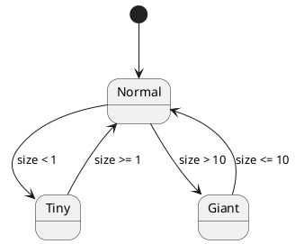

# State Diagram: Жизненный цикл Алисы
## Обзор
Эта диаграмма состояний показывает изменения состояния Алисы в зависимости от её размера (size) при взаимодействии с объектами EatMe и DrinkMe.
## Состояния
| Состояние | Описание |
|-----------|----------|
| Normal | Нормальный размер Алисы |
| Tiny | Маленький размер (очень уменьшена) |
| Giant | Огромный размер (сильно увеличена) |
## Переходы состояний
## Начальное состояние
- [*] --> Normal
## Переходы из Normal
- Normal --> Tiny : size < 1
- Normal --> Giant : size > 10
## Возврат к нормальному значению
- Tiny --> Normal : size >= 1
- Giant --> Normal : size <= 10
## Логика переходов
| Условие | Следующее состояние |
|---------|---------------------|
| size < 1 | Tiny |
| size > 10 | Giant |
| 1 <= size <= 10 | Normal |
## Ключевые моменты
- Состояние Алисы определяется текущим значением size
- Tiny - результат сильного уменьшения (например, после DrinkMe)
- Giant - результат сильного увеличения (например, после EatMe)
- Алиса возвращается в нормальное состояние при попадании размера в диапазон от 1 до 10
## Диаграмма

