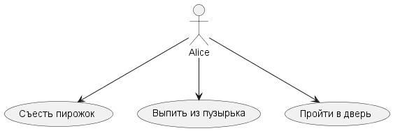
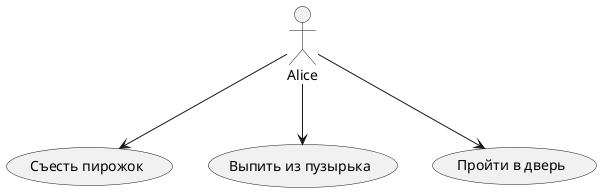

# Use Case Diagram: Управление состоянием Алисы
## Актёры
| Актёр | Описание |
|-------|----------|
| Alice | Главный персонаж, изменяющий свой размер |
## Варианты использования
## Пакет: Управление размером и доступом
| Вариант использования | Описание |
|-----------------------|----------|
| Съесть пирожок | Увеличивает размер Алисы |
| Выпить из пузырька | Уменьшает размер Алисы |
| Пройти в дверь | Попытка попасть в Garden |
## Связи
## Актёр к варианту использования
- Alice выполняет: Съесть пирожок
- Alice выполняет: Выпить из пузырька
- Alice выполняет: Пройти в дверь
## Логика сценария
- Съесть пирожок -> увеличивает size
- Выпить из пузырька -> уменьшает size
- Пройти в дверь -> доступ возможен только при size < 10
## Диаграмма

## Описание
Эта диаграмма вариантов использования иллюстрирует поведение Алисы:
1. Alice может съесть пирожок, чтобы увеличить свой размер
2. Alice может выпить из пузырька, чтобы уменьшить размер
3. После изменения размера Alice пытается пройти в дверь
4. Возможность пройти зависит от текущего значения size (доступ только если size < 10)
