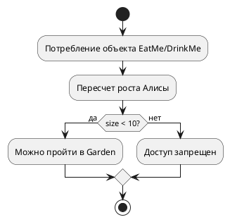

# Activity Diagram: Алгоритм системы "Алиса в Стране чудес"
## Обзор
Эта диаграмма активности показывает алгоритм изменения размера Алисы и проверки доступа в локацию Garden.
## Описание потока
### Шаг 1: Потребление объекта
- Алиса потребляет объект типа EatMe или DrinkMe
### Шаг 2: Пересчет роста
- Размер (size) Алисы изменяется в зависимости от объекта:
  - EatMe увеличивает размер
  - DrinkMe уменьшает размер
### Шаг 3: Проверка доступа в Garden
- Выполняется проверка условия: size < 10?
### Шаг 4: Результат проверки
- Да (size < 10) — Алиса может пройти в Garden
- Нет (size ≥ 10) — Доступ запрещен
## Точки принятия решений
| Условие | | Результат |
|---------| |-----------|
| size < 10 | Доступ разрешен |
| size ≥ 10 | Доступ запрещен |
## Диаграмма

