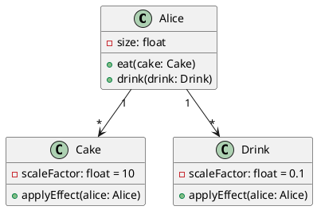

# Class Diagram: Алиса в Стране чудес
## Обзор
Эта диаграмма классов показывает объектно-ориентированную структуру системы изменения размера Алисы при взаимодействии с объектами EatMe и DrinkMe.
## Иерархия классов
## Основные сущности
| Class | Type | Attributes | Methods |
|-------|------|------------|---------|
| Alice | Concrete | - size: float | + eat(cake: Cake), + drink(drink: Drink) |
| Cake | Concrete | -scaleFactor: float = 10 | + applyEffect(alice: Alice) |
| Drink | Concrete | -scaleFactor: float = 0.1 | + applyEffect(alice: Alice) |
## Связи
- Alice --> Cake: Алиса может съесть пирожок
- Alice --> Drink: Алиса может выпить зелье
## Логика изменения размера
- Cake (EatMe) увеличивает размер Алисы:
  - size = size * 10
- Drink (DrinkMe) уменьшает размер Алисы:
  - size = size * 0.1
## Заметки
- Атрибут size определяет текущий размер Алисы
- Изменение размера происходит через метод applyEffect()
- Объекты Cake и Drink инкапсулируют логику масштабирования
- Значения scaleFactor задают коэффициент изменения размера
## Диаграмма

