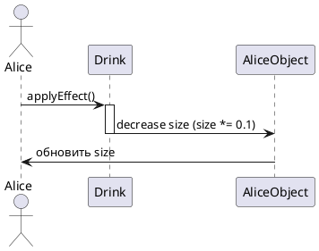

# Sequence Diagram: Взаимодействие в системе "Алиса в Стране чудес"
## Обзор
Эта диаграмма последовательности показывает процесс уменьшения размера Алисы при использовании объекта DrinkMe.
## Актеры и участники
| Актер/Участник | Описание |
|----------------|----------|
| Alice | Главный персонаж |
| Drink | Объект DrinkMe, уменьшающий размер |
| AliceObject (AliceObj) | Объект Алисы, хранящий состояние size |
## Interaction Steps
### Шаг 1: Инициация действия
- Alice вызывает метод applyEffect() у объекта Drink
### Шаг 2: Применение эффекта
- Drink активируется
- Drink изменяет размер AliceObj:
  - size = size * 0.1
### Шаг 3: Завершение действия
- Drink деактивируется
- AliceObj сообщает Alice об обновлении размера
## Ключевые наблюдения
1. Изменение размера инкапсулировано в классе Drink
2. Alice инициирует процесс, но не изменяет size напрямую
3. Коэффициент уменьшения равен 0.1
4. После изменения состояния происходит уведомление Alice
## Диаграмма

